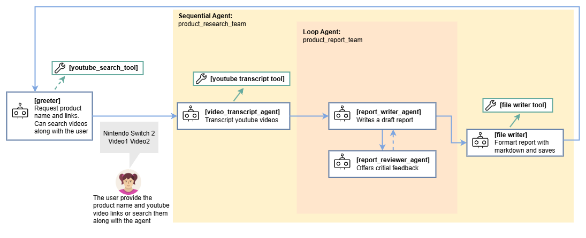

# Product Opinions Research Multiagent System


## Overview

TODO


### Agent architecture:

This diagram shows the detailed architecture of the agents and tools used
to implement this workflow.


## Setup and Installation

1.  **Prerequisites**

    *   Python 3.11+
    *   uv
        *   For dependency management and packaging. Please follow the
            instructions on the official
            [Poetry website](https://python-poetry.org/docs/) for installation.

        ```bash
        uv sync
        ```

    * A project on Google Cloud Platform
    * Google Cloud CLI
        *   For installation, please follow the instruction on the official
            [Google Cloud website](https://cloud.google.com/sdk/docs/install).

2.  **Installation**

    ```bash
    # Clone this repository.
    git clone
    cd
    # Install the package and dependencies.
    poetry install
    ```

3.  **Configuration**

    *   Set up Google Cloud credentials.

        *   You may set the following environment variables in your shell, or in
            a `.env` file instead.

        ```bash
        export GOOGLE_GENAI_USE_VERTEXAI=true
        export GOOGLE_CLOUD_PROJECT=<your-project-id>
        export GOOGLE_CLOUD_LOCATION=<your-project-location>
        export GOOGLE_CLOUD_STORAGE_BUCKET=<your-storage-bucket>  # Only required for deployment on Agent Engine
        ```

    *   Authenticate your GCloud account.

        ```bash
        gcloud auth application-default login
        gcloud auth application-default set-quota-project $GOOGLE_CLOUD_PROJECT
        ```

## Running the Agent

**Using `adk`**

ADK provides convenient ways to bring up agents locally and interact with them.
You may talk to the agent using the CLI:

```bash
adk run product-research-agent
```

Or on a web interface:

```bash
 adk web
```

The command `adk web` will start a web server on your machine and print the URL.
You may open the URL, select "academic_research" in the top-left drop-down menu, and
a chatbot interface will appear on the right. The conversation is initially
blank.

## Customization

The Product Opinions Research Agent can be customized to better suit your requirements. For example:

TODO
